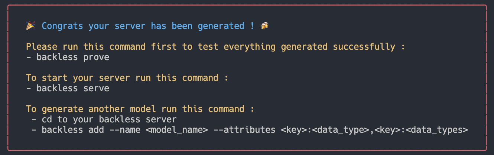

# Backless-Js

[](https://www.npmjs.com/package/backless) [](https://packagephobia.now.sh/result?p=backless) [](https://npm-stat.com/charts.html?package=backless)

#### Build your own application's server easier with our package. 

#### This application using ODM Mongoose for MongoDB, Express for server's framework, bcrypt.js for hashed password, jsonwebtoken for authentication, Mocha test framework and Chai as assertion library for test framework. 


## Table of Contents
* [Pre-requisite](#Pre-requisite)
* [Installation](#installation)
* [Version](#version)
* [Updating](#update)
* [Usage](#usage)
* [Add Another Models](#AddAnotherModels)
* [Authentication](#authentication)


## Pre-requisite

#### Make sure you have Node.js, MongoDB installed.

## Installation

#### After pre-requisite has fullfilled, then you can install Backless-Js in your machine globally with command

```shell
$ npm install -g backless
```

## Version

#### After installation, you can check the right version with this command 

```shell
$ backless --v
```
#### Or

```shell
$ backless --version
```

## Updating

#### If the version that you have isn't the latest version, you can update it with this command as you used to install the package before

```shell
$ backless install -g backless
```

## Usage

#### After you make sure that the version is the latest, you can run this package to start build your server with this command

```shell
$ backless create
```
### 1. Database Input

#### After you run the command above, you will found text below. In this section you decide a name to your database that you want to use and press enter. The default name is (Backless-DB)


### 2. Model Input

#### Next step, you will found this text below. In this section you have to type model's name to your database.The default name is (Foobar)


### 3. Attributes Input
#### In this part, you will found text below and you have to decide the attribute's name for your model. The default name is (name)


#### After you decided the attribute's name, choose the type for this attribute. The default type is (String)


#### The last step of this section, you can choose to add another attribute by type "Y" or "yes" (this is the default if you're not choose or type anything) or you can choose NO by type  "n" or "no". 


### 4. Port Input
#### In this section, you choose in which port you want to use. The default for this port is 3000. 


### 5. Jsonwebtoken Secret key Input
#### After you input the port before port, you will found this text below and input that text to set your jsonwebtoken secret key in your '.env' file. the secret key default is 'Backless_Secret' if you let it empty.


### Wait for a minute


### And Voilaa.... your server is ready to use!


## Add Another Models

##### If you want to add another model for your server, you can use this command

```shell
$ backless add --name <ModelName> --attributes <key:dataTypes>
```
##### "ModelName" is a name for your model (example: UserModel), "key" is for attribute's name and "dataTypes" is for attribute's type (String, Number, Boolean, Array)

### Example's Input

##### Example to add one attribute.
```shell
$ backless add --name UserModel --attributes name:string
```

##### You also can add multiple attributes for one model.
```shell
$ backless add --name UserModel --attributes name:string,bornDate:number,isMale:boolean
```

## Authentication

### We gave you authentication method already. You can comment the authentication's route, if you didn't need that.


