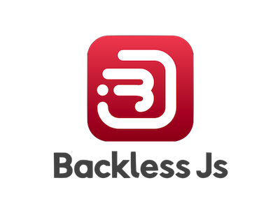

# Backless Js

[](https://www.npmjs.com/package/backless) [](https://packagephobia.now.sh/result?p=backless) [](https://npm-stat.com/charts.html?package=backless)

## INSTANT EXPRESS REST API GENERATOR. 
#### What packages does Backless Js REST API included?
 - ODM Mongoose for MongoDB
 - Express for server's framework
 - BcryptJs for hashing password
 - Jsonwebtoken for Authentication
 - Mocha test framework
 - Chai as assertion library for test framework 


## Table of Contents
* [Pre-requisite](#Pre-requisite)
* [Installation](#installation)
* [Version](#version)
* [Updating](#update)
* [Usage](#usage)
* [Authentication](#authentication)


## Pre-requisite
#### All items below must already installed in your machine
```shell
 Node Js & MongoDB 
```

## Installation

#### Install Backless Js globally using this command

```shell
$ npm install -g backless
```
##### or
#### You could create Backless Js REST API instantly using this command

```shell
$ npx backless create
```
## Version

#### If you installed globally make sure you've already installed Backless Js correctly using this command 

```shell
$ backless --v
```
#### Or

```shell
$ backless --version
```

## Updating

#### To make sure our INSTANT EXPRESS REST API generator work correctly please make sure to always updated it to newer version using the same command as you install globally

```shell
$ npm install -g backless
```

## Usage

#### You can run this command to start generating new server

###### Notes : Make sure there is no server folder in your working directory otherwise Backless wont create new server

```shell
$ backless create
```
### 1. Database Input

#### In this section please input database name to your database that you want to use and press enter. The default name is (Backless-DB)


### 2. Model Input

#### Please input model name to your database.The default name is (Foobar)


### 3. Attributes Input
#### In this part, you will found text below and you have to decide the attribute's name for your model. The default name is (name)


#### After you decided the attribute's name, choose the type for this attribute. The default type is (String)


#### The last step of this section, you can choose to add another attribute by type "Y" or "yes" (this is the default if you're not choose or type anything) or you can choose NO by type  "n" or "no". 


### 4. Port Input
#### In this section, you choose in which port you want to use. The default for this port is 3000. 


### 5. Jsonwebtoken Secret key Input
#### After you input the port before port, you will found this text below and input that text to set your jsonwebtoken secret key in your '.env' file. The secret key default is 'Backless_Secret' if you let it empty.


### Wait for a minute


### And Voilaa.... your server is ready to use !


## Add Another Models

##### If you want to add another model for your server, you can use this command
###### Notes : Make sure you're currently on your working directory the same as Backless Server folder exist

```shell
$ backless add --name <Model Name> --attributes <key> : <dataTypes>,<key> : <dataTypes>
```
##### "ModelName" is a name for your model (example: UserModel), "key" is for attribute's name and "dataTypes" is for attribute's type (String, Number, Boolean, Array) to add another attributes please use ',' to seperate each attribute

### Example's Input

##### Example to add one attribute.
```shell
$ backless add --name UserModel --attributes name:string
```

##### You also can add multiple attributes for one model.
```shell
$ backless add --name UserModel --attributes name:string,bornDate:number,isMale:boolean
```

## Authentication

### We gave you authentication method already. You can comment the authentication's route, if you didn't need that.
##### Notes : this images below are located on index routes folder


